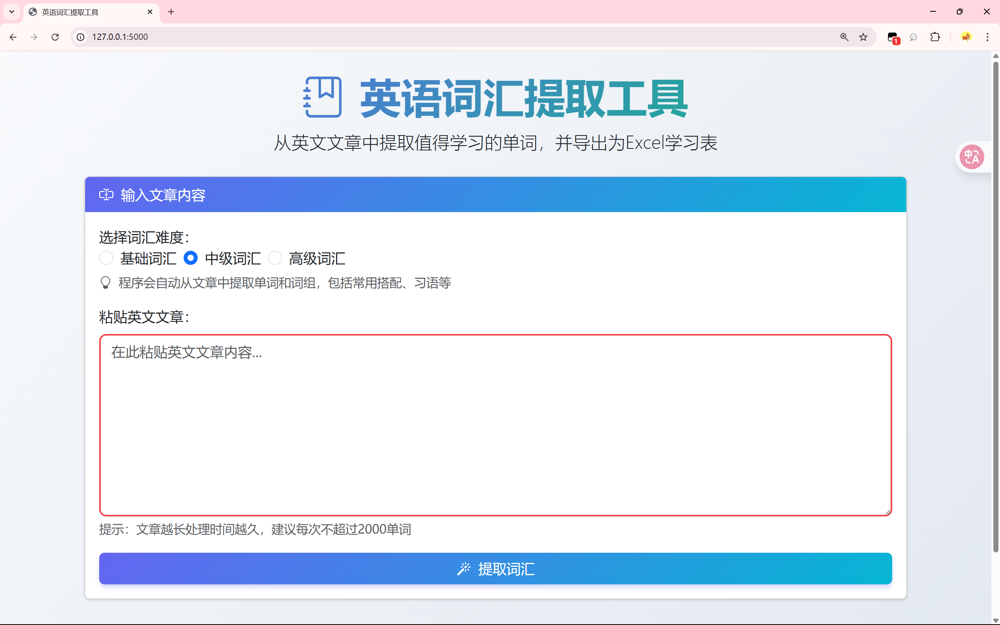
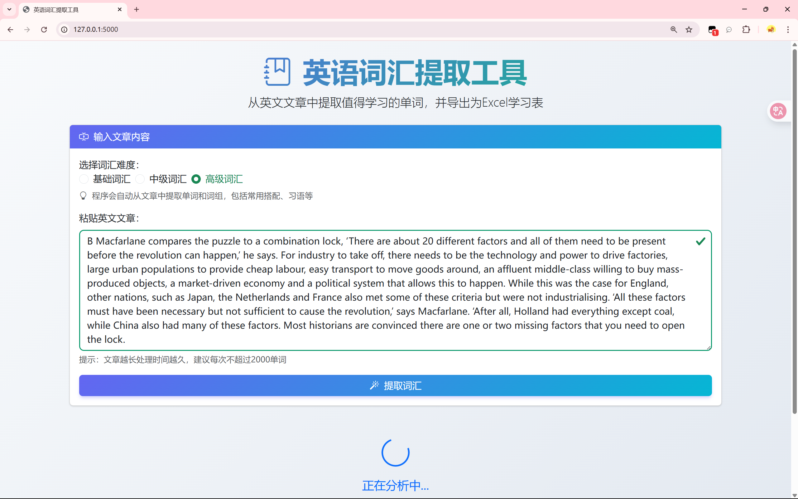
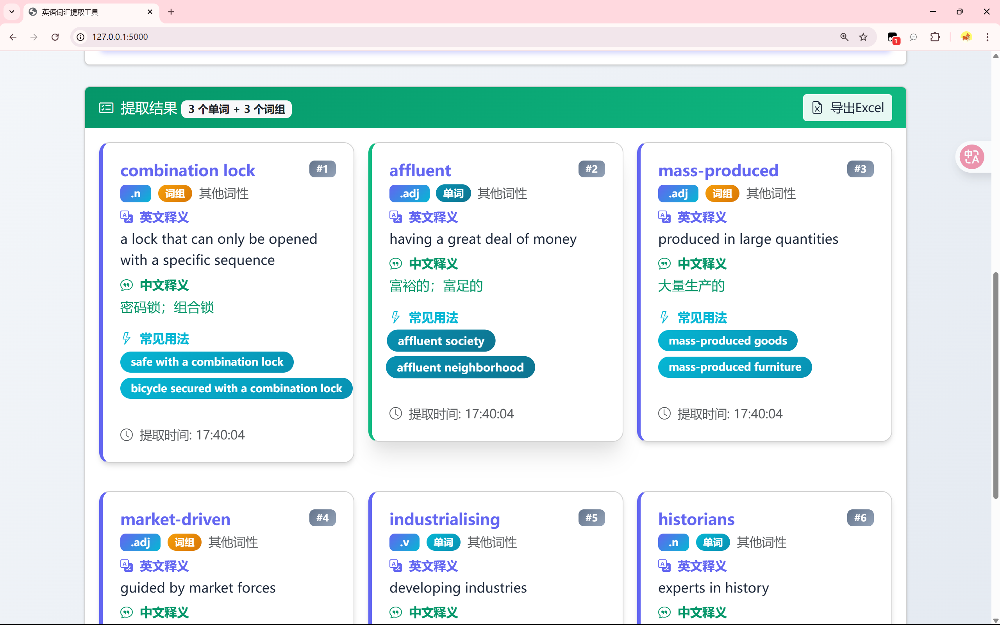
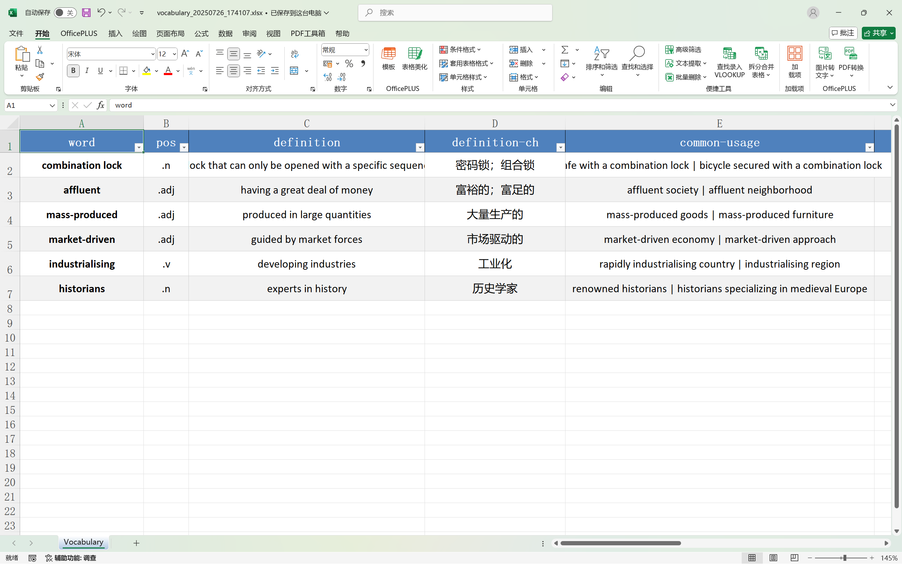

# 英语词汇提取工具

> 基于Flask + OpenAI API 的英文文章单词与词组智能提取与Excel导出工具

---

## 项目简介

本项目是一个面向英语学习者和教师的实用工具，能够从英文文章中自动提取值得学习的单词和常用词组，并支持一键导出为Excel表格，方便后续背诵和整理。界面美观，操作简单，适合自学、课堂、科研等多种场景。

## 主要功能

- 支持粘贴英文文章，自动智能识别并提取单词和词组（如动词短语、名词短语、习语等）
- 词汇卡片展示：包括英文、词性、英文释义、中文释义、常见用法等
- 支持选择词汇难度（基础/中级/高级）
- 一键导出词汇为Excel表格，便于整理和背诵
- 现代化响应式前端，支持PC
- 加载动画与友好提示，操作流畅

## 技术栈

- Python 3.11+
- Flask
- OpenAI API
- Pandas, Openpyxl
- Bootstrap 5, jQuery
- HTML5, CSS3, JavaScript

## 安装与运行

1. **克隆项目**

   ```bash
   git clone <your-repo-url>
   cd article-extractor
   ```

2. **创建虚拟环境并安装依赖**

   ```bash
   python3 -m venv venv
   source venv/bin/activate
   pip install -r requirements.txt
   ```

3. **配置环境变量**
   - 在项目根目录下创建 `.env` 文件，内容如下：

     ```env
     OPENAI_API_KEY=你的OpenAI密钥
     BASE_URL=https://api.openai.com/v1
     MODEL=gpt-3.5-turbo
     LOG_LEVEL=INFO
     ```

4. **运行项目**

   ```bash
   python app.py
   ```

   默认在 <http://localhost:5000> 访问

## 使用说明

1. 粘贴英文文章，选择词汇难度，点击“提取词汇”
2. 程序自动分析并展示单词和词组卡片
3. 可一键导出为Excel表格

## 截图演示

> 以下为实际界面截图，帮助你快速了解工具的使用效果：



*主界面：粘贴英文文章，选择难度，点击提取*


*词汇卡片展示：包含释义、用法等信息*


*一键导出Excel：便于整理和背诵*

## 目录结构

```text
article-extractor/
├── app.py                # Flask主程序
├── extractor.py          # 词汇与词组提取核心逻辑
├── utils/
│   └── excel_export.py   # Excel导出工具
├── static/
│   ├── css/style.css     # 前端样式
│   └── js/app.js         # 前端交互逻辑
├── templates/
│   └── index.html        # 主页面模板
├── requirements.txt      # 依赖列表
├── logs/                 # 日志文件
├── exports/              # 导出的Excel文件
└── ...
```

## 贡献方式

欢迎提交PR、建议或反馈！

1. Fork本仓库
2. 新建分支 `feature/xxx`
3. 提交更改并发起PR

## 许可证

MIT License

---

> 由巨幕牌猫粮驱动，助力你的英语学习之路！
